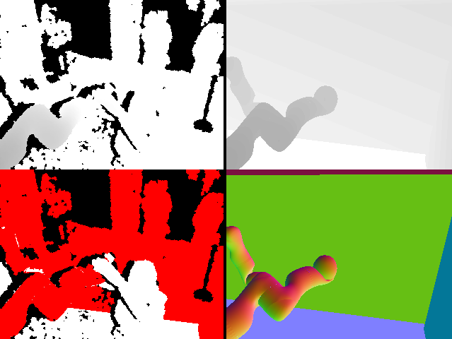
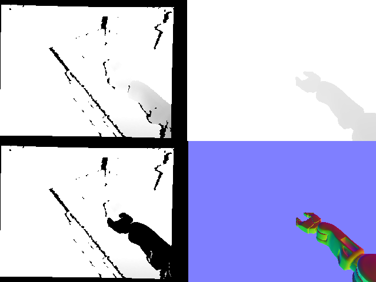
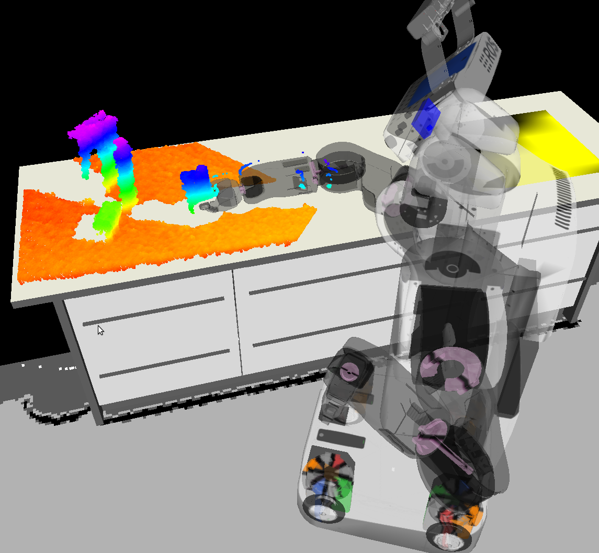

realtime_urdf_filter
====================

This package provides OpenGL-accelerated, shader-based filtering for depth
images. Scene geometry is defined in URDF models, along with parameters
defining the camera's location and filtering parameters.  Both static
environment models and articulated robot models are working beautifully, as
long as TF latency is not too high.

Incoming Kinect frames are transferred to the GPU as textures, and the scene is
rendered from the same point of view. As a result, we can access the measured
as well as the virtual depth map in the shader, where we can define efficient
comparison operations.

Example of robot self filtering to preprocess for human skeleton tracking:



Robot self filtering for object manipulation:






Dependencies
------------

This has been verified to run on Ubuntu 14.04 with ROS Indigo.

This package requires the following: 3rd party libraries
 - GLSL (GL Shader Language) version 1.40 support or greater
 - GLEW (GL Extension Wrangler) version 1.6

NOTE: Trying to use this package with GLEW 1.5 will result in a segmentation fault.

ROS Interface
-------------

There are two ROS nodes that can be used out of the box:

- realtime_urdf_filter

  This is a node that subscribes to a depth map topic, and outputs the filtered
  depth map on `/output`.

- urdf_filtered_tracker

  This node is basically the openni tracker with additional functionality to
  pre-filter the depth image before it's sent to the skeleton tracker.

  `urdf_filtered_tracker` accesses the Kinect directly through OpenNI, and
  hooks itself in between the depth image generator node and the skeleton tracker
  node, so any "known" geometry that could potentially confuse the skeleton
  tracker (e.g. robot arms, people in background, static furniture) can be
  deleted.

  This has been used at Automatica 2012, where an operator was tracked to allow
  control of the robot arms using gesture recognition. Two robot arms needed to
  be filtered to allow stable skeleton tracking also for hand over tasks.
  Additionally, the camera was pointed towards a busy walkway intersection, so
  two virtual walls were added that filtered passing visitors from the depth
  data.


Adapting it to different scenarios
----------------------------------

There are two example launch files provided that show basic usage and
parametrization and are a good starting point.

The following `rosparam` parameters are supported:

- `fixed_frame` is used to specify the "fixed" TF link (e.g. `/map`,
  `/world`, etc.). This is useful to decouple tf lookups with different
  publishing frequencies, e.g. robot and static publishers.
- `camera_frame` specifies the camera TF frame (e.g.
  `/camera_rgb_optical_frame`)
- `camera_offset` lets you specify additional offsets to the camera link. It
  has two components: `translation` (e.g. `[0.0, 0.0, 0.0]`) and
  `rotation` (e.g. `[0.0, 0.0, 0.0, 1.0]`).
- `models` contains a list of URDF models that are supposed to be filtered.
  For each, `model` defines the rosparam key that contains the URDF model,
  and `tf_prefix` contains, well, the tf prefix.
- `depth_distance_threshold` pixels with a depth difference of less than this
  value get filtered.
- `filter_replace_value` (for `urdf_filtered_tracker`) defines the new
  value that will be written to the filtered pixel depth values. Interestingly,
  setting `0` creates beautiful silhouettes, but the OpenNI tracker needs
  "background" (more distant) pixels around people. Weird. That's why we set
  this value to 5 meters.
- `show_gui` specifies whether a visualization window should pop up.

Also, the shaders in `include/shaders/` can easily be adapted. The vertex
shader is basically just a pass through, so the fragment shader is more
interesting for adding features. The shader as of now has access to 4 color
attachments, and the red channel of gl_FragData[1] is used to return the
filtered image. The other attachments can be used for visualization (see
`show_gui`).

Note: starting remotely
-----------------------

While this package uses offscreen rendering, it does need to connect to a X11
server to get a valid OpenGL context (even with `show_gui` set to `false`).
When launching one of the nodes in this package remotely via roslaunch or
similar mechanisms, it will be necessary to set a DISPLAY variable and possible
turn off access control for the X server. In this case, a bash script like the
following can be launched from remote::

```
    #!/bin/bash
    DISPLAY=:0
    xhost +
    roslaunch realtime_urdf_filter tracker.launch
```

Troubleshooting
---------------

Every once in a while, Assimp fails when importing STL files. If the first 5
bytes are "solid", it treats it as ASCII, however there are several binary STL
files around that start with "solid". You'll get an error message along the
lines of:

```
    [ERROR] [1360339850.748534073]: Could not load resource [package://pr2_description/meshes/sensors/kinect_prosilica_v0/115x100_swept_back--coarse.STL]: STL: ASCII file is empty or invalid; no data loaded
```

You can double check with e.g.:

```
    hexdump -C bad_stl_file.STL | head
```

In that case, a simple work around (read: "hack") is to replace the "solid"
with "rolid", and assimp loads it as a binary file.

```
    printf 'r' | dd of=bad_stl_file.STL bs=1 seek=0 count=1 conv=notrunc
```

I'm not exactly sure why RViz does not seem to have this problem.

License
-------

The code is licensed under the BSD License, see the LICENSE file in the project
root dir.

